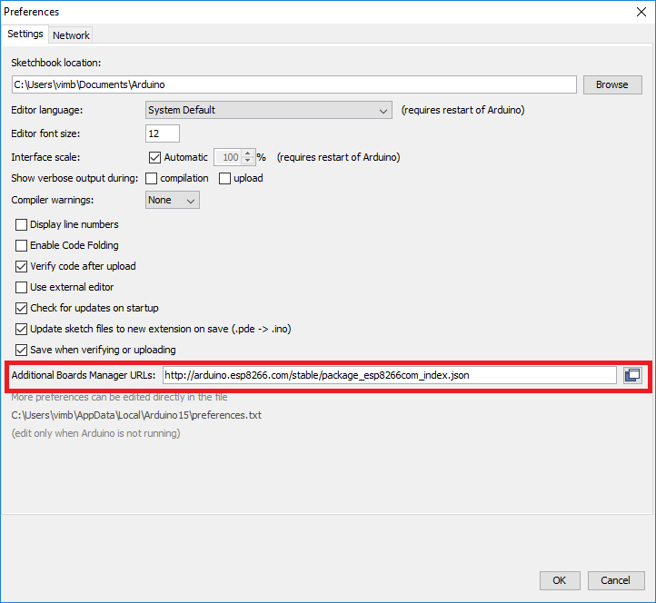
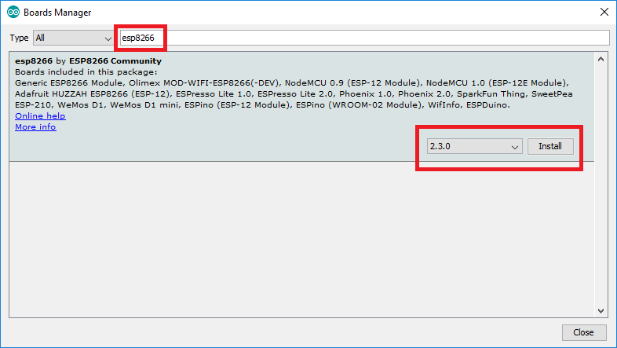
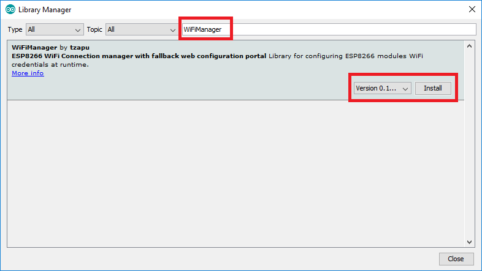
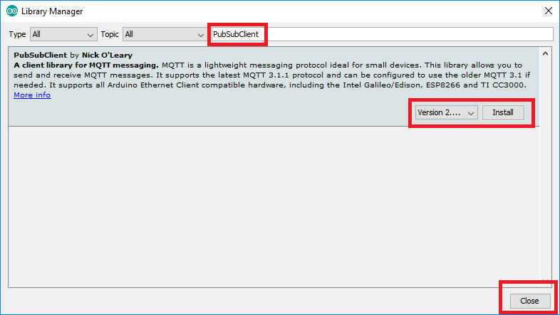

# Lesson 1 - Arduino Software Setup


## Download and Install Arduino IDE

The Arduino IDE is a free and open-source program which lets you write, compile, and upload programs to a very large number of devices, including your ESP8266 module.

Follow [these "Install the Arduino Software (IDE)" directions](https://www.arduino.cc/en/Guide/HomePage) to get the IDE installed on your computer. 

Note that the word "Arduino" often refers to a couple different things:

* [Arduino IDE Software](https://www.arduino.cc/en/Main/Software)
  * This is what you just installed
* [Arduino hardware](https://www.arduino.cc/en/Main/Products)
  * These are the microcontroller boards which are officially supported by the Arduino IDE
  * The design of these boards is open-source, so there are plenty of cheap alternatives which are perfectly compatible
* [Arduino programming language](https://www.arduino.cc/en/Reference/HomePage) 
  * This is the language which we will use in this tutorial to program your ESP8266 module
  * The [official tutorials](https://www.arduino.cc/en/Tutorial/BuiltInExamples) are the best way to learn this language - most of them will run on your ESP8266 module with a bit of tweaking, but you might find it easier to pick up something like this [$8 Arduino Nano V3 Compatible Module](https://www.amazon.com/Qunqi-Nano-V3-0-ATmega328-Arduino/dp/B010LQJIF0) which will run the examples unmodified


## Install USB-Serial Drivers

There are a number of different USB-to-serial chips used in ESP8266 modules - depending on the chip and your operating system, you may or may not have drivers already built in. The Arduino IDE also installs a number of drivers.

The most common additional drivers you may want to install are:
* CH340/341 drivers - [Windows](http://www.wch.cn/download/CH341SER_ZIP.html), [OSX](http://www.wch.cn/download/CH341SER_MAC_ZIP.html)
  * This will be required if you're using the [Gizwits Witty](../Witty/info) or most [NodeMCU](../NodeMCU/info) modules
* FT232x drivers - [All OS](http://www.ftdichip.com/Drivers/VCP.htm)
* CP210x drivers - [All OS](http://www.silabs.com/products/mcu/Pages/USBtoUARTBridgeVCPDrivers.aspx)


## Install ESP8266 Board Definition

The Arduino IDE you installed does not natively support the ESP8266. Fortunately it's quite easy to add support via the "Boards Manager".

Note: Official documentation for Arduino ESP8266 support can be found [here](https://github.com/esp8266/Arduino).

### Add the ESP8266 Board Manager URL

* In the Arduino menu, go to File->Preferences on Windows and Arduino->Preferences on OSX
* Enter ```http://arduino.esp8266.com/stable/package_esp8266com_index.json``` into *Additional Board Manager URLs* field
* Hit ```OK``` so save your preferences



### Install the ESP8266 Platform

* In the Arduino menu, go to Tools->Board->Boards Manager
* Search for ```esp8266```
* Click on the esp8266 entry, select the latest version, and hit ```Install```
  * This may take a couple minutes since it needs to download and install all of the ESP8266 tools
* Hit ```Close``` once you are done




## Install Arduino Libraries

Arduino libraries are code other members of the Arduino community have written, packaged, and released for you to use. One of the strengths of the Arduino community is the number and quality of libraries which make it simple and fast to add a lot of complex capabilities to your code. We will use the "Library Manager" in the Arduino IDE to install a couple libraries necessary for our tutorial.

* In the Arduino menu, go to Sketch->Include Library->Manage Libraries
* Search for and install the latest versions of the following libraries:
  * WiFiManager
    * This library gives you the classic IoT "connect to a special access point and enter in your WiFi credentials" setup experience
    * [Official documentation](https://github.com/tzapu/WiFiManager)
  * PubSubClient
    * This library supports publishing and subscribing to an MQTT server
    * [Official documentation](http://pubsubclient.knolleary.net/)
* Hit ```Close``` once you are done





