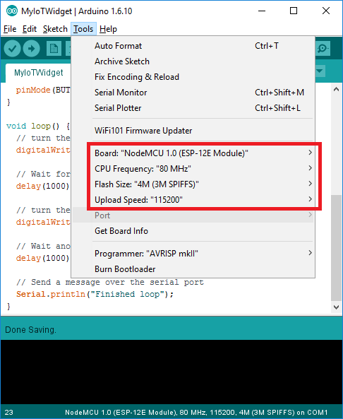
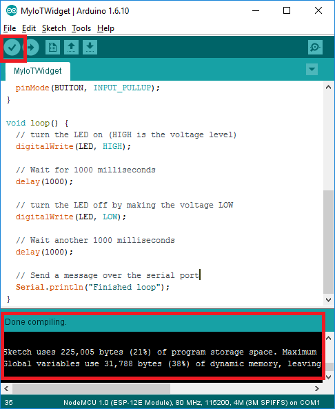
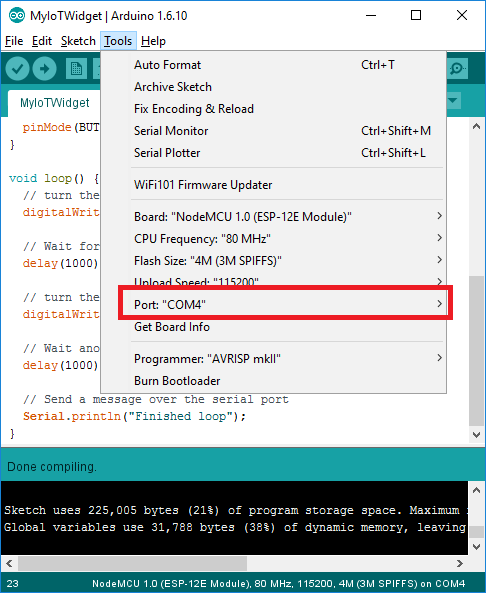
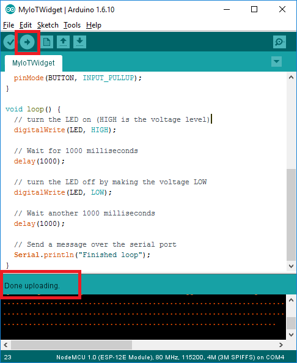
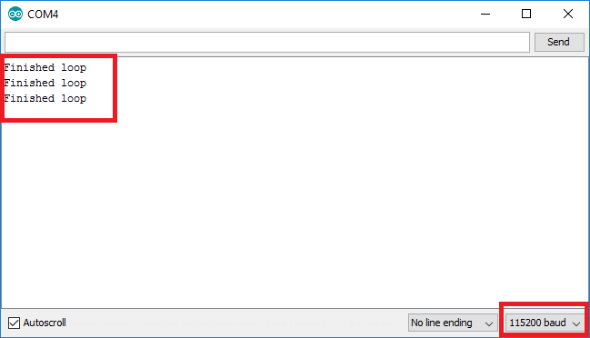

## **Create a new Arduino sketch**

1. Open Arduino and make sure you see a default sketch
2. Go to File->Save As and save it as ```MyIoTWidget``` in a convenient location

## **Add some #includes**

At the top of your sketch, add the following code:


// Base ESP8266
#include <ESP8266WiFi.h>
WiFiClient WIFI_CLIENT;


This will "include" a reference to ESP8266-specific libraries and constants which are necessary for your code to run on an ESP8266. It will also create a global WifiClient which other parts of your code may use to access the network.

Note: Anything that comes after ```//``` is a comment - it will be ignored by Arduino but is helpful to keep around so that you remember what your code is supposed to do.


## **Add some #defines**

In the Arduino language, you can define one name to mean something else using ```#define```. This is typically used to make your code easier to read. 

Right after the ```#include``` lines you added earlier, but before ```setup()```, add the following code:


#define LIGHT_SENSOR A0
#define LED 15
#define BUTTON 4


Here we have included a ```#define``` for each of the pins that we will use on the ESP8266 module - this way we can refer to them by the names we have given above rather than having to remember their pin numbers.


## **Update setup()**

The code within the curly braces of the ```setup()``` function is run once every time the ESP8266 starts up. Let's change this function to the following: 


// This function runs once on startup
void setup() {
  // Initialize the serial port
  Serial.begin(115200);

  // Configure light sensor pin as an input
  pinMode(LIGHT_SENSOR, INPUT);

  // Configure LED pin as an output
  pinMode(LED, OUTPUT);

  // Configure BUTTON pin as an input with a pullup
  pinMode(BUTTON, INPUT_PULLUP);
}


## **Update loop()**

The code within the curly braces of the ```loop()``` function is run once in a never-ending loop. let's change this function to the following:


// This function runs over and over again in a continuous loop
void loop() {
  // Turn the LED on (HIGH is the voltage level)
  digitalWrite(LED, HIGH);

  // Wait for 1000 milliseconds
  delay(1000);

  // Turn the LED off by making the voltage LOW
  digitalWrite(LED, LOW);

  // Wait another 1000 milliseconds
  delay(1000);

  // Send a message over the serial port
  Serial.println("Finished loop");
}


This is the classic "blink an LED" program taken straight from the Arduino examples, slightly modified to work with the ESP8266 and also exercise the Serial port. 


## **Run your sketch**

Before we proceed, make sure your code looks like [this](MyIoTWidget.ino)

### Select the proper board

1. From the Arduino menu, go to Tools->Board and select your particular ESP8266 module if it's available
  * If you are using the [Gizwits Witty](../Witty/info.html) or some other module which isn't listed, select ```NodeMCU 1.0 (ESP-12E Module)``` instead
2. Ensure the other settings are appropriate
  * CPU Frequency can either be 80MHz for lower power consumption or 160MHz for higher performance
  * Flash size should be set to 4M (3M SPIFFS) for most modules - this gives you 1MB for code and 3MB for filesystem space
  * Upload Speed should be set to 115200

Note: You generally only have to set this up once each time you open a new sketch. 




### Verify your sketch

1. In the upper left, click on the checkmark icon to begin compiling your sketch
2. Wait a couple seconds as your sketch is compiled
3. Look at the logs at the bottom and make sure no red errors or warnings are reported

Note: This step is entirely optional - your sketch is recompiled and checked for errors each time it is downloaded. This is just a way to get an preview of any errors without having to download.



### Set your ESP8266 module serial port

1. Plug in your ESP8266 module into your computer
  * If this is the first time plugging in your ESP8266 module on Windows, please wait a minute or two until drivers finish installing
2. Go to the Arduino menu Tools->Port and select the appropriate port corresponding to your module
  * On Windows, it will start with "COM", eg: ```COM4```
  * On OSX, it will start with "/dev/wchusbserial", eg: ```/dev/wchusbserialfd120```
  * If you are not sure with port to pick, unplug your module, note down which ports are available, plug in your module, and then see which port was added - that is the one you should choose.

Note: You generally only have to do this once each time you open a new sketch. Arduino should remember the port selection even when you unplug and replug the device, but it's always good to double-check



### Upload your sketch

For the ESP8266 modules, this is generally the trickiest part - be sure to follow these directions in the exact order they are listed, otherwise it will not work.

1. Make sure your ESP8266 module is unplugged from your computer
2. Press and hold the button marked ```Flash``` on your ESP8266 module *while* simultaneously plugging it into your computer over USB
  * This puts your ESP8266 module into download mode and prepares it to receive a new sketch
  * Once you have plugged in your ESP8266 module into your computer, wait a couple seconds and release the ```Flash``` button - the module will remain in download mode until code is downloaded to it or it is unplugged
3. In the upper left, click on the arrow icon to compile and upload your sketch
  * This can take 20-30 seconds, so be patient
  * When it is done you will see a "Done uploading" message and your sketch will automatically start running
  * If you see any errors, first verify your sketch to make sure it's not a problem with your code and then try following this entire upload procedure again




## **Test your sketch**

This is a very simple sketch, so it's easy to see if it's working or not.

* Make sure the LED is blinking
* Check the serial console for messages
  1. From the Arduino menu, select Tools->Serial Monitor
  2. Change the data rate in the bottom right to ```115200```
  3. Look for ```Finished loop``` messages appearing every two seconds




