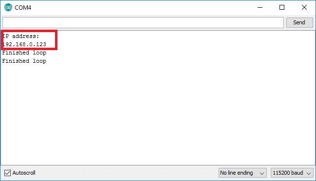

# Lesson 3 - ESP8266 WiFi Setup

## Connect to WiFi in ```setup()```

We generally want to connect to WiFi as soon as our module starts up, so let's add the following code to the end of ```setup()```

```
setup() {
	...whatever was in setup before...

	// Attempt to connect to a specific access point
	WiFi.begin("<your wifi access point name>", "<your wifi access point password>");

	// Keep checking the connection status until it is connected
	while (WiFi.status() != WL_CONNECTED) {
	    delay(500);
	}

	// Print the IP address of your module
	Serial.println("IP address: ");
	Serial.println(WiFi.localIP());
}
```

Note: Don't forget to substitute ```<your wifi access point name>``` and ```<your wifi access point password>``` with your actual WiFi network name and password otherwise this won't work.

## Test your sketch

Before we proceed, make sure your code looks like [this](MyIoTWidget.ino) except with the right value substituted in.

### Get your module IP address

If your ESP8266 is successfully connected to a wifi network, it should automatically be assigned an IP address by the router. 

This IP address is what the router (and other devices on your local network / wifi) can use to communicate with your module. 

* Download your sketch and open up the serial monitor - within 10-20 seconds, you should see a line with the IP address of your ESP8266 module. 
  * If your ESP8266 connects too fast and you don't have time to open the Serial Monitor and catch the IP address line, considering adding in a ```delay(5000);``` right before the IP address is printed



Note: Pretty much every device which is connected to the internet or to a local network has an IP address, and they communicate with each other by sending "packets" of data which include the destination IP address, source IP address, and any content. 

### Ping your module

One of the simplest protocols in networking is ICMP Echo request and response, more commonly known as "ping". If you know a target device's IP address, you can "ping" it to check if it's online and working. 

* Open up a terminal
  * In Windows, search for "cmd.exe" or "Command Prompt" and run it
  * In OSX, search for "Terminal" and run it
* Verify that your ESP8266 is connected to the network by trying to ping it
  * At the terminal prompt, type ```ping <your module IP address>``` and look for a reply
  * Output from this command looks slightly different between Windows and OSX, but it's close enough
  * By default, Windows will end ping after 4 requests, while OSX will continue until you press Ctrl-C to kill it


Note: Most devices connected to a network, including your ESP8266 module, will respond to ping requests.


## Learn More

From a networking point of view, your ESP8266 module is the same as your desktop or laptop or phone or any other device connected to the internet. The basic concept behind "Internet of Things" is taking the same networking protocols and infrastructure which allow your computing devices to communicate over the internet, and reusing it to let your microcontrollers and embedded modules communicate over the internet.

If you want a deep understanding of how the internet works, learn about the basic protocols behind it:

* Ethernet - physical layer protocol
* ARP - runs on top of Ethernet
* IP - runs on top of Ethernet
* TCP - runs on top of IP
* DNS - runs on top of IP
* ICMP - runs on top of IP
* HTTP - runs on top of TCP
* SMTP - runs on top of TCP
* MQTT - runs on top of TCP


