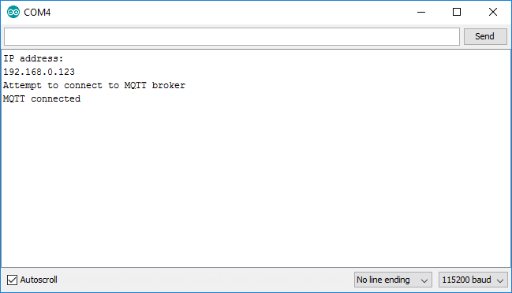

# Lesson 4 - ESP8266 MQTT Publish

The MQTT protocol is a lightwight publish-subscribe protocol which is very popular for IoT applications.

#### MQTT Brokers

In order for this protocol to work, there needs to be a server which routes messages between clients - in the MQTT, this server is known as a "broker". It's relatively easy to [set up your own MQTT broker](https://mosquitto.org/), but it's even easier to use one of several [publicly available free MQTT brokers](https://github.com/mqtt/mqtt.github.io/wiki/public_brokers).

For this tutorial we will use the free public [```iot.eclipse.org```](http://iot.eclipse.org/sandbox.html) MQTT broker:

* address: iot.eclipse.org
* port: 1883 (tcp), 80 (websockets)

#### MQTT Clients

Each client device which connects to an MQTT broker is asked to provide a unique client identifier. The broker uses this unique client identifier to track clients and push messages to them. 

If a broker receives multiple connections with the same client identifier, it may choose to send messages to only one of them, even if they all subscribed to the same topic. 

In general each physical device client should have a unique client identifier. Likewise, each running copy of a software client should have its own unique client identifier. 


#### MQTT Topics

The main concept to understand in MQTT is "topics" - these are channels of information which clients can publish to or subscribe to messages from.

Topics in MQTT are organized in an hierarchy seperated by forward slashes, eg: ```iot_widgets/lightbulbs/light_88234323```

For this tutorial, you should choose a random and unique topic root and then place all your topics underneath that, eg: ```vimal_22x7654/iot_widgets/lightbulbs/light_88234323```. Since we are using a public MQTT broker, this will minimize the chances of your application interfering with someone else's application

#### MQTT Messages

An MQTT message simply consists of a topic (string) and a payload (byte array). It is up to the clients to decide what conventions to follow for payloads, trading of message size and parsing speed for ease of human reading and debugging.

For this tutorial we will limit ourselves to sending MQTT messages which are exclusively short text strings.

#### MQTT Publish

Once a client device is connected to an MQTT broker, it can publish a message at any time by specifying the topic and payload. Note that multiple clients may all publish messages to the same topic.

For this tutorial, both our ESP8266 module and our webpage will publish messages to topics.

#### MQTT Subscribe

Once a client device is connected to an MQTT broker, it can also subscribe to a topic by specifying the topic and a callback function which will eb run every time someone publishes a message onto the topic.

Note that multiple clients may all subscribe to the same topic, in which case when a message is published to that topic, it will be received by all clients. 

For this tutorial, both our ESP8266 module and our webpage will subscribe to topics and run code when a message is received.

#### MQTT Wildcards

If a client subscribes to a topic ending in a wildcard "/*", then it will receive messages sent to all matching subtopics. For example if a client subscribes to ```iot_widgets/lightbulbs/*``` then it will receive messages published to ```iot_widgets/lightbulbs/light_88234323``` and ```iot_widgets/lightbulbs/light_92365477``` topics. 

We will not be using wildcard topics in this tutorial.


## Include PubSubClient

In order to use the MQTT-compatible Arduino [PubSubClient library](http://pubsubclient.knolleary.net/), we first need to #include a reference to the library and then create a client instances for both the WiFi connection and the MQTT connection.

Near the top of your sketch immediately underneath all of the existing #include lines, add the following:

```
// MQTT
#include <PubSubClient.h>
PubSubClient MQTT_CLIENT;
```

## Create a reconnect() function

Network connections are not always perfectly reliable - they sometimes get accidentally disconnected which means all network-aware code should be capable of reconnecting as necessary.

Because we may have to connect and reconnect to our MQTT broker multiple times, let's create a new function which will do that for us.

Between the ```setup()``` and ```loop()``` functions, add the following new function:

```
void reconnect() {
  // Set our MQTT broker address and port
  MQTT_CLIENT.setServer("iot.eclipse.org", 1883);
  MQTT_CLIENT.setClient(WIFI_CLIENT);

  // Loop until we're reconnected
  while (!MQTT_CLIENT.connected()) {
    // Attempt to connect
    Serial.println("Attempt to connect to MQTT broker");
    MQTT_CLIENT.connect("<your_random_device_client_id>");

    // Wait some time to space out connection requests
    delay(3000);
  }

  Serial.println("MQTT connected");
}
```

Note: Be sure to replace ```<your_random_device_client_id>``` with a randomly chosen identifier for your device, like ```esp8266_4562234```


## Update loop() to reconnect and publish a message

Our old ```loop()``` simply blinked an LED, but now we need it to be a bit smarter. Specifically every 5 seconds, let's have it do the following:

* Check if it's connected to the MQTT broker and reconnect if necessary
* Publish a message to a topic

Replace the existing ```loop()``` function with the following:

```
void loop() {

  // Check if we're connected to the MQTT broker
  if (!MQTT_CLIENT.connected()) {
    // If we're not, attempt to reconnect
    reconnect();
  }

  // Publish a message to a topic
  MQTT_CLIENT.publish("<your_random_topic_root>/iot_tutorial/from_esp8266", "Hello world!");

  // Wait five seconds
  delay(5000);
}
```

Note: Be sure to replace ```<your_random_topic_root>``` with a unique randomly chosen root name for this tutorial, eg: ```iot_tutorial_6645393```


## Test your sketch

Before we proceed, make sure your code looks like [this](MyIoTWidget.ino) except with the right values substituted in.

Download your sketch and open up the serial monitor - you should see log messages once you have connected successfully to the MQTT broker. 


