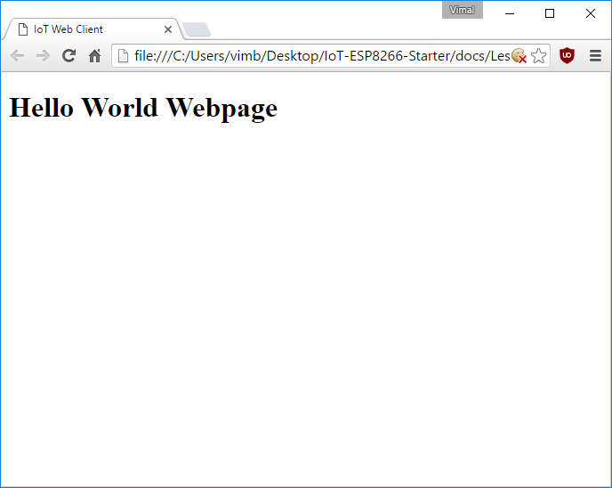
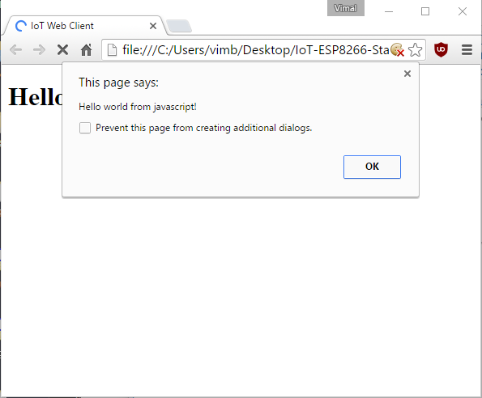
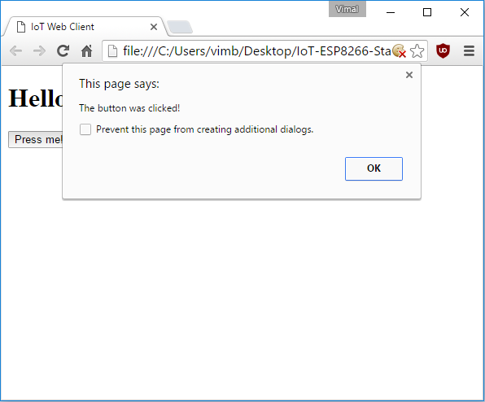
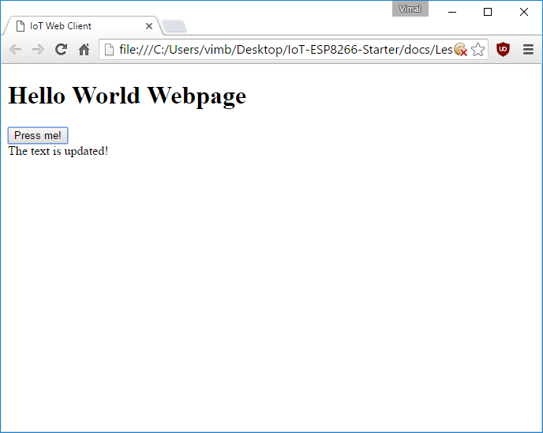

# Lesson 5 - HTML/Javascript Hello World

Just as you were getting comfortable with Arduino, let's switch over to making a website!

There are thousands of good resources online for learning basic HTML, CSS, and Javascript, and there are thousands of tools, utilities, libraries, and frameworks to choose from.


## Create an ```index.html``` web page

For a good introduction to HTML syntax and some basic tags, check out the [w3schools HTML tutorial](http://www.w3schools.com/html/default.asp)

For this tutorial, we'll be making an exteremly simple HTML page.

1. Create a folder for your website somewhere convenient on your computer
2. Create a file named ```index.html``` and open that file in a text editor
3. Paste the following content into that file

```
<!DOCTYPE html>
<html>

  <head>
    <title>IoT Web Client</title>
  </head>

  <!-- this is an HTML comment -->
  <body>
    <h1>Hello World!</h1>
  </body>

</html>
```

Now if you double-click on index.html it should open up in a web browser and you should see something like: 




## Create an ```app.js``` javascript script

For a good introduction to Javascript syntax and some basic functions, check out the [w3schools Javascript tutorial](http://www.w3schools.com/js/default.asp)

For this tutorial, we'll be writing an extremely simple Javascript script.

1. In the same website folder where you created ```index.html```, create a new file named ```app.js``` and open that file in a text editor
2. Paste the following content into that file

```
// This will pop up an alert as soon as the script is run
alert("Hello world from javascript!");
```


## Add javascript to ```index.html```

Javascript can be added to a HTML page by including ```<script>``` tags which reference external javascript files.

Typically ```<script>``` tags are enclosed within the ```<body>``` tag and are towards the end after all of the content.

Let's add the jquery javascript library and our own custom javascript file to our page. To do that, replace the contents of the ```<body>``` tag in ```index.html``` with the following:

```
  <body>
    <h1>Hello World!</h1>

    <script src="https://code.jquery.com/jquery-3.1.0.min.js"></script>
    <script src="app.js"></script>
  </body>
```

Now if you reopen or reload index.html, you should see an alert like: 




## Run javascript by clicking a button

To make web pages which respond to user actions, you first need to add elements for the users to interact with and then you need to connect in a javascript function which can be triggered when that element is interacted with.

As an example first let's add a ```<button>``` tag to the body. To do that, replace the contents of the ```<body>``` tag in ```index.html``` with the following:

```
  <body>
    <h1>Hello World!</h1>

    <!-- this is the secton wrapping our new button -->
    <div>
      <button onClick="myButtonWasClicked()">Press me!</button>
    </div>

    <script src="https://code.jquery.com/jquery-3.1.0.min.js"></script>
    <script src="app.js"></script>
  </body>
```

Note that this button will try to run the javascript function ```myButtonWasClicked()``` when it is clicked. Since that function doesn't yet exist, let's create it by replacing the contents of ```app.js``` with:

```
function myButtonWasClicked() {
    alert("The button was clicked!");
}
```

Now if you reopen or reload index.html and click the button labeled ```Press me!```, you should see an alert like: 




## Make javascript update your page

Another thing which javascript can do is modify the content of your webpage by either adding, removing, or replacing HTML elements.

As an example first let's add an empty ```<div>``` tag to the body which we will later update with text using javascript. To do that, replace the contents of the ```<body>``` tag in ```index.html``` with the following:

```
  <body>
    <h1>Hello World!</h1>

    <!-- this is the secton wrapping our new button -->
    <div>
      <button onClick="myButtonWasClicked()">Press me!</button>
    </div>

    <!-- this is where new text will appear -->
    <div id="updateMe">
    </div>

    <script src="https://code.jquery.com/jquery-3.1.0.min.js"></script>
    <script src="app.js"></script>
  </body>
```

Now let's change our button to update the ```<div>``` text instead of showing an alert. In ```app.js```, replace the ```myButtonWasClicked()``` function with the following:

```
function myButtonWasClicked() {
    // Select the tag with id="updateMe" and set its inner content
    $("#updateMe").text("The text is updated!");
}
```

Now if you reopen or reload index.html and click the button labeled ```Press me!```, you should modify the page to look like: 




## Test your webpage

Before we proceed, make sure your index.html looks like [this](index.html) and your app.js looks like [this](app.js).

Close any open copies of your mini website that you may have, and then double-click on ```index.html``` to open it up in a new browser window or tab. If you click the button labeled ```Press me!```, you should modify the page to look like: 


