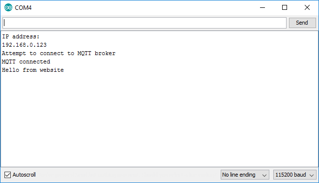

Now that we have a web page which is publishing MQTT messages, let's update our Arduino code to subscribe to those messages.

### Create a message received callback function

Each time we receive a message from the MQTT broker, we want to take the payload and do something with it. Let's create an arduino function named ```myMessageArrived``` to handle the incoming message and print it to the console.

To does this, add the following code right before the ```reconnect()``` function:

```
// This function handles received messages
void myMessageArrived(char* topic, byte* payload, unsigned int length) {
  // Convert the message payload from bytes to a string
  String message = "";
  for (unsigned int i=0; i< length; i++) {
    message = message + (char)payload[i];
  }
   
  // Print the message to the serial port
  Serial.println(message);
}
```

### Subscribe to an MQTT topic and set the MQTT client to use the callback function

Now that we created the ```myMessageArrived``` function, we need to subscribe to a topic and tell ```MQTT_CLIENT`` to call our callback function it every time a message arrives. To do this, add the following code to the end of the ```reconnect()``` fuction:

```
  // Subscribe to the topic where our web page is publishing messages
  MQTT_CLIENT.subscribe("<your_random_topic_root>/iot_tutorial/from_webpage");

  // Set the message received callback
  MQTT_CLIENT.setCallback(myMessageArrived);
```

Note: Be sure to replace ```<your_random_topic_root>``` with the exact same value that you used in your web page and elsewhere in your Arduino code. In theory this just needs to match the topic which your web page is publishing to, however to keep things simple we will reuse the same random root topic.

### Update loop() to check for incoming messages

Unlike javascript, the Arduino client actively requires you to periodically call a function in order to check for new messages. A quick and easy way to do this is to add the following line to the end of your ```loop()``` function:

```
  // Check for incoming MQTT messages
  MQTT_CLIENT.loop();
```


## Test your sketch

Before we proceed, make sure your Arduino code looks like [this](MyIoTWidget.ino) except with the right values for the following substituted in:

* ```<your wifi access point name>```
* ```<your wifi access point password>```
* ```<your_random_device_client_id>```
* ```<your_random_topic_root>```

Also make sure your index.html looks like [this](index.html) and your app.js looks like [this](app.js) except with the right values for the following substituted in:

* ```<your_random_topic_root>```


Close any open copies of your web page that you may have, and then double-click on ```index.html``` to open it up in a new browser window or tab.

Then download your sketch and open up the serial monitor - you should see log messages once you have connected successfully to the MQTT broker.

Now hit the ```Press me!``` button on your web page and within a couple seconds you should see the message from your web page published to your serial console:



If you don't see any incoming messages, a couple things to double-check include:

* Make sure the ESP8266 module has successfully connected to ```iot.eclipse.org``` port ```1883```
* Make sure your webpage has successfully connected to ```iot.eclipse.org``` port ```80``` path ```/ws```
* Make sure the topic name your web page is publishing to exactly matches the topic name your ESP8266 module Arduino code is subscribing to
