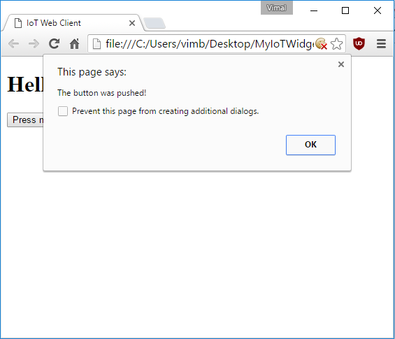

Now that we have the basics of a web page and an ESP8266 module which can pass messages back and forth over the internet, let's wee if we can make our website react to a button being pressed on our ESP8266 module

Whether you are using the button built into the [Gizwits Witty](../Witty/info.html) or using the [breadboard setup](../Breadboard/setup.md), the button is wired the same way - one end is connected to the button input pin and the other end is connected to ground.

The button input pin is connected to a +3.3V power source via a large internal resistor (~10K to ~100K ohms). This resistor is built into the ESP8266 itself and is enabled when we set ```pinMode(BUTTON, INPUT_PULLUP);``` in ```setup()```.

When the button is not pressed, the input pin is pulled to a +3.3V ```HIGH``` voltage level through the resistor, so ```digitalRead(BUTTON)``` will return ```HIGH```. 

When the button is pressed, the input pin is connects directly to ground though the button, so ```digitalRead(BUTTON)``` will return ```LOW```. 


## **Detect a button press on the ESP8266 module**

To detect a button press, we check if ```digitalRead(BUTTON)``` returns ```LOW```. To prevent a long press from being detected as multiple button presses, we wait until the button is released (```digitalRead(BUTTON)``` returns ```HIGH```) and then process the button press.

In our case, we want the button press to send a "button pushed" message to our web page.

To do this, replace the the ```loop()``` function in your ESP8266 Arduino code with the following:


// This function runs over and over again in a continuous loop
void loop() {

  // Check if we're connected to the MQTT broker
  if (!MQTT_CLIENT.connected()) {
    // If we're not, attempt to reconnect
    reconnect();
  }

  // If the button is pressed
  if(digitalRead(BUTTON) == LOW) {

    // Wait for the button to be released
    while(digitalRead(BUTTON) == LOW) {
      delay(100);    
    }

    // Publish a button pushed message to a topic
    MQTT_CLIENT.publish("<your_random_topic_root>/iot_tutorial/from_esp8266", "button pushed");

  }

  // Check for incoming MQTT messages
  MQTT_CLIENT.loop();
}


Note: You should remember to replace ```<your_random_topic_root>``` with the exact same value that you used in elsewhere in your Arduino code and web page. 

## **Show a web page alert on "button pushed"**

Our web page is already receiving the all messages and displaying them, but let's make it do something special like show an alert if the specific "button pushed" message is received.

To do this, add the following snippet of code to the end of the ```myMessageArrived(message)``` function in ```app.js```:


  // Check for "button pushed" messages
  if(messageBody == "button pushed") {
    // Show an alert if one is received
    alert("The button was pushed!");
  }


## **Test your sketch and web page**

Before we proceed, make sure your Arduino code looks like [this](MyIoTWidget.ino) except with the right values for the following substituted in:

* ```<your wifi access point name>```
* ```<your wifi access point password>```
* ```<your_random_device_client_id>```
* ```<your_random_topic_root>```

Also make sure your index.html looks like [this](index.html) and your app.js looks like [this](app.js) except with the right values for the following substituted in:

* ```<your_random_topic_root>```


Close any open copies of your web page that you may have, and then double-click on ```index.html``` to open it up in a new browser window or tab.

Then download your sketch and open up the serial monitor - you should see log messages once you have connected successfully to the MQTT broker.

Now hit the button connected to your ESP8266 module and within a couple seconds you should see an alert on your web page:



