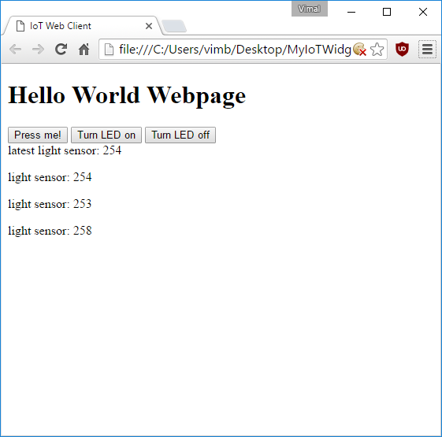

# Lesson 11 - IoT Sensor

One pretty common IoT use case is having a remote sensor stream back telemetry. Let's make our ESP8266 module periodically publish a light sensor reading which can be displayed on our web page.

Whether you are using the light sensor built into the [Gizwits Witty](../Witty/info.html) or using the [breadboard setup](../Breadboard/setup.md), the light sensor is wired the same way - one end of a CDS cell is wired to the analog input pin, while the other is wired to a +3.3V power source. A fixed resistor of about 10 kOhm is wired with one end connected to the analog input pin and the other end connected to ground.

The CDS cell acts like a variable resistor - when it's dark it has a very high resistance (up to 200 kOhm) while when exposed to light its resistance can drop to 5-10 kOhm. By connecting it to a known fixed resistor, we create a voltage divider where the votage at the middle varies depending on the resistance of the CDS cell.

When it is dark, the CDS cell has a resistance much higher than the fixed resistor, so the fixed resistor "wins" and pulls the voltage at the analog input pin low. When it is light, the CDS cell resistance drops and it starts to "win" more, pulling the voltage at the analog input pin higher. 

You can read this analog input pin using ```analogRead(LIGHT_SENSOR)```. The returned value will be between 0 and 1024, where 0 corresponds to 0V and a dark environment while 1024 corresponds to 1V and a bright environment. Be careful not to let the voltage exceed 1V on the analog input pin, or you might damage the ESP8266 module. 


### Take a light sensor reading and send a message from the ESP8266 module

We probably only want to send light sensor readings every five seconds or so, but our ```main()``` loop is starting to do a lot of things and if we add a ```delay(5000)``` in there to limit our sensor reading rate, we might also delay other important processes such as checking for button presses or checking for incoming messages.

Instead let's track the time when we took a sensor reading, and if the current time is greater than 5 seconds from the last time we took a reading, let's take a new reading and update the timestamp. 

To do this, first declare a global variable for tracking the last time a sensor reading was taken by adding the following lines to the ESP8266 Arduino code immediately before the ```setup()``` function:

```
// Tracks the last time a sensor reading was taken
long lastSensorReading = 0;
```

Then let's insert the following lines of code at the very end of the ```loop()``` function:

```
  // Check if it has been more than five seconds since last light sensor reading
  if((millis() - lastSensorReading) > 5000) {
    // Take a new light sensor reading
    int sensorReading = analogRead(LIGHT_SENSOR);

    // Construct the message
    String message = "light sensor: ";
    message = message + sensorReading;

    // Publish the message
    MQTT_CLIENT.publish("<your_random_topic_root>/iot_tutorial/from_esp8266", message.c_str());

    // Update last sensor reading to current time
    lastSensorReading = millis();
  }
```

Note: You should remember to replace ```<your_random_topic_root>``` with the exact same value that you used in elsewhere in your Arduino code and web page. 


### Check for "light sensor" messages and display the latest value on the web page

Our web page is already receiving the all messages and displaying them, but let's make it track the latest value of the light sensor in a specific place.

First let's add a placeholder to display the value in the HTML. Immediately before the ```<div id="updateMe">``` tag in ```index.html```, add the following:

```
    <!-- this is where the light sensor reading will appear -->
    <div id="lightSensorValue">
    </div>
```


Now let's check for "light sensor" messages and update that placeholder. To do this, add the following snippet of code to the end of the ```myMessageArrived(message)``` function:

```
  // Check for "light sensor" messages
  if(messageBody.startsWith("light sensor")) {
    // Update the id=lightSensorValue placeholder
    $("#lightSensorValue").text("latest "+messageBody);
  }
```

## Test your sketch and web page

Before we proceed, make sure your Arduino code looks like [this](MyIoTWidget.ino) except with the right values for the following substituted in:

* ```<your wifi access point name>```
* ```<your wifi access point password>```
* ```<your_random_device_client_id>```
* ```<your_random_topic_root>```

Also make sure your index.html looks like [this](index.html) and your app.js looks like [this](app.js) except with the right values for the following substituted in:

* ```<your_random_topic_root>```


Close any open copies of your web page that you may have, and then double-click on ```index.html``` to open it up in a new browser window or tab.

Then download your sketch and open up the serial monitor - you should see log messages once you have connected successfully to the MQTT broker.

Now hit the ```Turn LED on``` and ```Turn LED off``` buttons on your web page, and within a couple seconds you should see the LED connected to your ESP8266 module change appropriately.

Wait a couple seconds and you should start seeing light sensor readings appearing on your web page:


