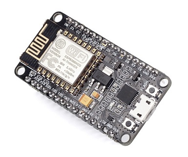

## **Buy It Now**

  * [$5 on AliExpress](http://www.aliexpress.com/item/New-Wireless-module-NodeMcu-Lua-WIFI-Internet-of-Things-development-board-based-ESP8266-with-pcb-Antenna/32593655688.html)
  * [$9 on Amazon](https://www.amazon.com/HiLetgo-Version-NodeMCU-Internet-Development/dp/B010O1G1ES)

## **Opinions**

  * Pro - It's narrow and has a breadboard-friendly form factor and pin layout
  * Pro - It's a popular and well-documented board
  * Con - It must be hooked up to external parts for this tutorial

## **Setup Notes**

  * This board needs to be [wired into a breadboard](../Breadboard/setup.html) for this tutorial

## **Resources**

  * [CNXSoft Article](http://www.cnx-software.com/2015/04/18/nodemcu-is-both-a-breadboard-friendly-esp8266-wi-fi-board-and-a-lua-based-firmware/)
    * Good overview of board features and pinout
  * [my2cents NodeMCU Comparison Blog Post](http://frightanic.com/iot/comparison-of-esp8266-nodemcu-development-boards/)
    * Review of different NodeMCU modules available on the market
  * [Official NodeMCU DevKit Documentation](https://github.com/nodemcu/nodemcu-devkit-v1.0)
    * All of the technical details of the NodeMCU module
