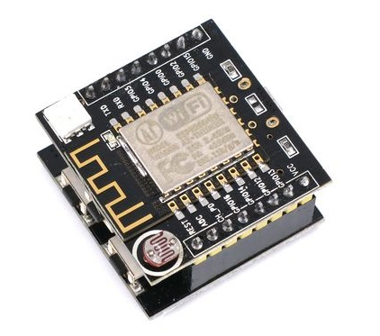

## **Buy It Now**

  * [$5 on AliExpress](http://www.aliexpress.com/item/10PCS-LOT-ESP8266-serial-WIFI-model-ESP-14-Authenticity-Guaranteed/32592556329.html)
  * [$12 on Amazon](https://www.amazon.com/Wangdd22-ESP8266-Development-ESP-12F-nodemcu/dp/B01EJ734CA)


## **Opinions**

  * Pro - It's the board I use most often for this tutorial
  * Pro - Integrates a button, an LED, and a photoresistor so you can start tinkering right away without any breadboards or external parts
  * Con - It has to be plugged into base to be programmed making it clumsy to integrate into breadboard circuits
  * Con - Button placement supposedly reduces WiFi range, though only by ~2/3 of the original range


## **Setup Notes**

  * This board is ready to be plugged in and used in the tutorial
  * LED notes:
    * Red channel is on GPIO15 - ```digitalWrite(15, value)```
    * Green channel is on GPIO12 - ```digitalWrite(12, value)```
    * Blue channel is on GPIO13 - ```digitalWrite(13, value)```
    * Some cheap versions of this board have a [non-functional LED](http://www.esp8266.com/viewtopic.php?f=13&t=7409&start=20)
  * Light sensor notes:
    * CDS cell is hooked up to ADC - ```analogRead(A0)```
    * Make sure the ADC input voltage is always between 0V and 1V
  * Button notes:
    * Button is hooked up to GPIO4 - ```digitalRead(4)```
    * Be sure to enable internal pullup - ```pinMode(4, INPUT_PULLUP)```
    * Button pushed = LOW, button released = HIGH
    * The button supposedly [limits WiFi range](http://www.esp8266.com/viewtopic.php?f=13&t=7409&start=24)


## **Resources**

  * [Simon's Journal Blog Post](https://blog.the-jedi.co.uk/2016/01/02/wifi-witty-esp12f-board/)
    * Good information and sample Arduino code
  * [ESP8266 Community Forum Thread](http://www.esp8266.com/viewtopic.php?f=13&t=7409)
    * Lots of real-world info and experience with this particular module
  * [My Internet of Things Automation Article](http://www.my-iota.com/Development%20boards/Witty%20Cloud%20(GizWits)%20-%20ESP8266%20Development%20Board/Witty%20Cloud%20(GizWits)%20-%20ESP8266%20Development%20Board.htm)
    * Overview of board features and alternative firmwares to use with it
